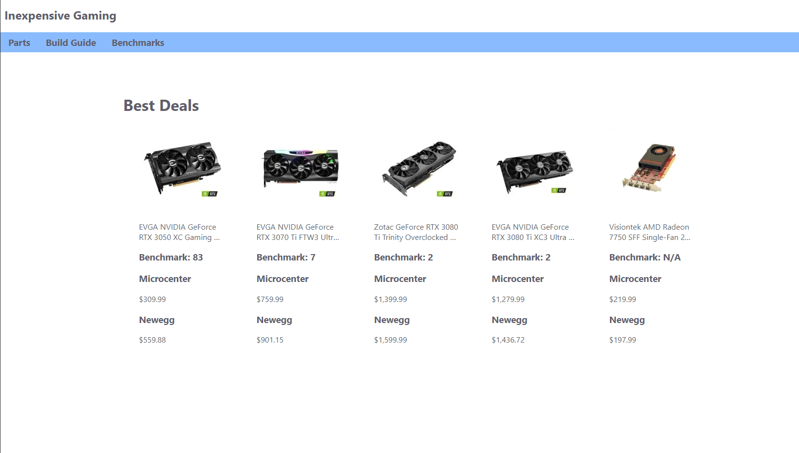
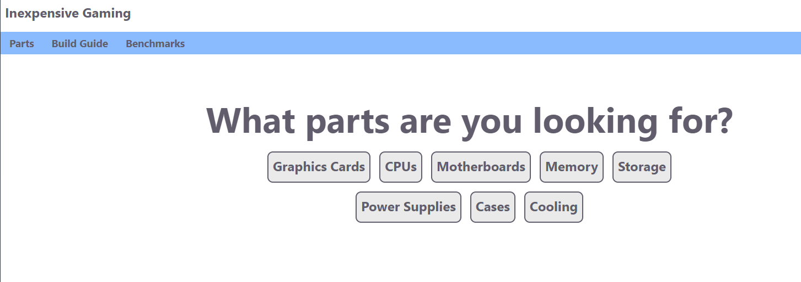
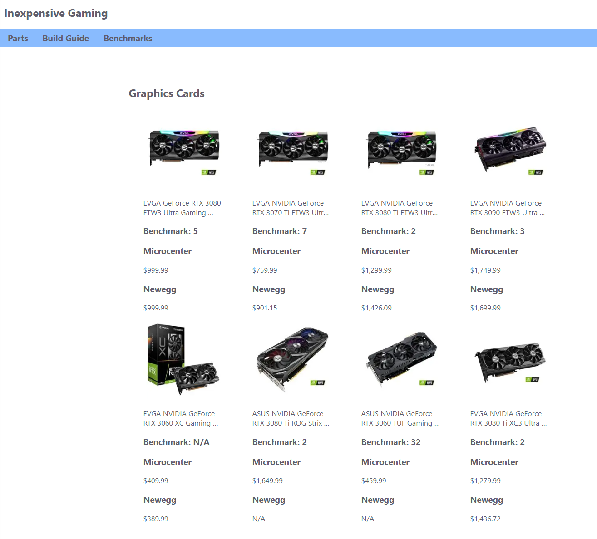
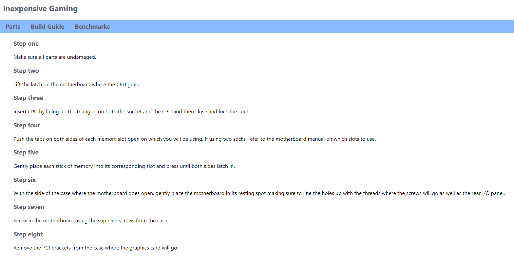

# Home Page

The home page serves as a resource to see some of the current best deals. This means that there is a large difference between the price of the part on Microcenter versus Newegg. From here you can select one of the tabs at the top of the website to go to either the Parts page where you can search for parts or go to the Build Guide to learn how to build a PC. Benchmarks is not currently implemented.

# Parts Page

The parts page allows you to select which type of part you would like to search for. We currently only have data for Graphics Cards and CPUs. Selecting either Graphics Cards or CPUs will bring you to a page where you can select which Manufacturer you would like to search for.

Once you have selected the brand you would like to search for you will see all current in stock parts for your query. For each part you will be able to see it's: image, name, benchmark, prices. Benchmark is a measure of relative performance which can be used to determine which parts will perform better than others. You can then determine which price is smaller and click on the link for either Microcenter or Newegg to be brought to the page where you can purchase the part.

 

# Build Guide

The Build Guide features a simple guide for building a PC once you have received your parts. This is intended for users with some knowledge of PCs in general. There are links supplied at the bottom for more in-depth videos to ensure you do everything correctly.

# FAQ

## "Is AMD or NVIDIA better?"
- This question doesn't exactly have an answer. NVIDIA generally benchmarks higher, but this sometimes comes at a cost. Both brands are very reputable and the current generation of graphics cards are very capable of playing todays games.

## "Is Intel or AMD better?"
- This depends on your use case. The theme of this site is gaming in which case Intel generally tends to be better, however, this again comes at a price. If on a very tight budget, AMD is likely the best option.

## "Is the benchmark the only figure I should consider?"
- While the benchmark is very important, price should also be considered. For gaming, the difference between a $1500 graphics card and a $2000 one is not very noticeable. Because of this, it is not always worthwile to go for the most expensive parts, especially if you are on a budget.