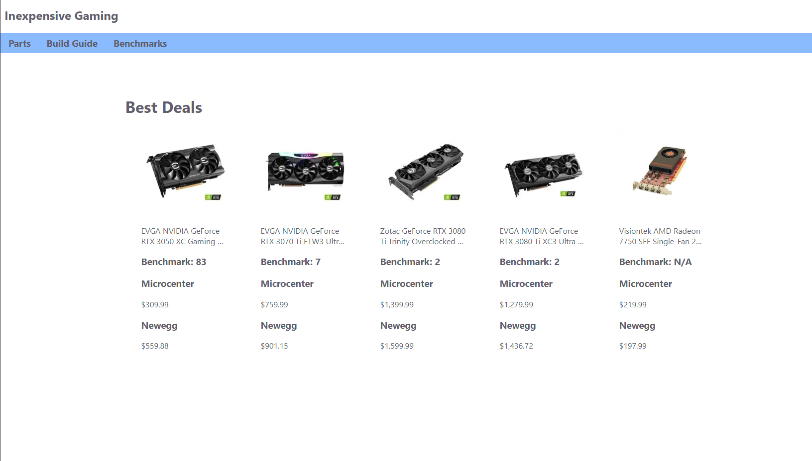
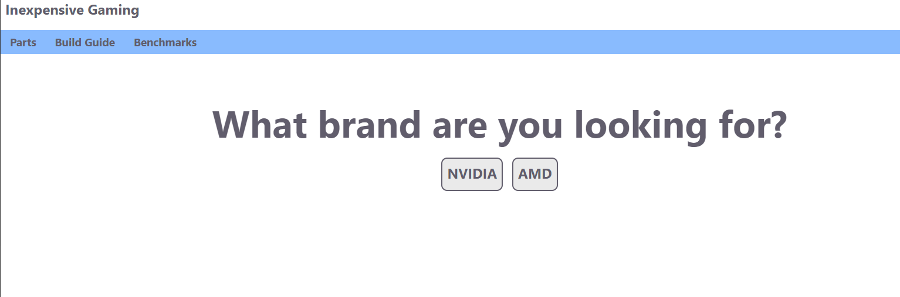

# User Interface Specification

## Pages
- Home Page (/)
  - Header(Title, Parts, Build Guide, Benchmarks)
  - Row of 5 of the best deals
    - Image of the part
    - Benchmark rank
    - Microcenter Link
    - Microcenter Price
    - Newegg Link
    - Newegg Price

- Parts Page (/parts)
  - Header(Title, Parts, Build Guide, Benchmarks)
  - Group of buttons to different types of parts

- Brand Selection Page (/parts/{part}/brandselection)
  - Header(Title, Parts, Build Guide, Benchmarks)
  - Group of buttons to different brands of parts

- Part Listing Page (/parts/{part}/{brand})
  - Header(Title, Parts, Build Guide, Benchmarks)
  - Text showing what parts are listed
  - Grid of parts
    - Image of the part
    - Benchmark rank
    - Microcenter Link
    - Microcenter Price
    - Newegg Link
    - Newegg Price

 

- Build Guide Page (/buildguide)
  - Header(Title, Parts, Build Guide, Benchmarks)
  - List of steps to build a pc
    - Descriptioin of step
  - Links to videos of PC building tutorials

