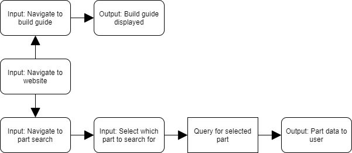
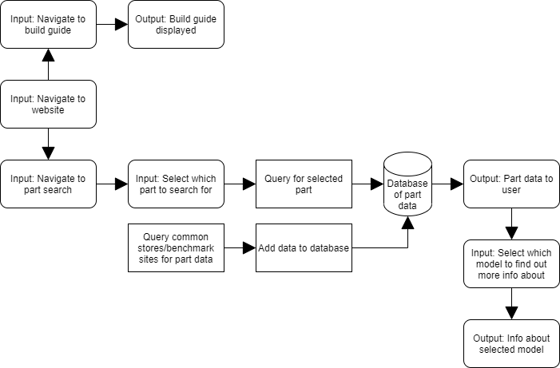

# Inexpensive Gaming
- Members: Josh Lenhart, Josh Timmers
- Advisor: Jillian Aurisano, PhD

# Abstract
It is estimated that nearly half of the world enjoys gaming. PC gaming makes up a large portion of this. There is an incredible amount of technology that goes into this. To be at the forefront of this, having the newest PC parts is a great start. This isn't always feasible for people as the parts can be quite expensive. In order to aid in this our team plans to create a website to show the best deals and their associated performance. This will help any user get the best bang for the buck as well as knowing how well the parts will perform.

# Project Description
While there are solutions out there like pcpartpicker.com, this is not a complete package. The goal is not to just have the best prices or benchmarks. The goal is to have a full suite with everything needed for people who may not know a lot about building PCs. This is where most current tools fall behind. This tool will have biggest discounts, potentially better bang for the buck items, resources for building the PC once the parts arive, and much more.

There will be many different technologies used in this tool. The website itself will use HTML, CSS, and React. This will aid in making the website very interactable as well as intuitive. The back end will use Python and most likely a MySQL database. The Python will be used to scrape multiple different sites for data to be used in the website. The MySQL database will be used to store all of the data that is scraped. This will then all come together to create a user friendly experience.

In order to accomplish this, many technologies will be combined. There will be a homepage with some of the biggest deals along with the different pages for other parts of the site. This would include a search bar for searching for parts, guides for building the PC, performance charts, and much more. In order to get this data, many sites would be scraped for prices and benchmarks. A job would be ran on a consistent basis such as every hour or daily in order to get the data.

# User Stories
* As a gamer, I want to know how well PC parts will perform in my favorite games before I buy them, so I can wisely spend my money.
* As a PC builder, I want to know the current deals going on for the parts I want, so I can take advantage of discounts.
* As a PC builder, I want to know if I should spend more money on one part rather than another to get the best performance, so I don't spend a lot of money for a part that will be bottlenecked.
* As someone interested in building a PC, I want to learn how to build a PC, so I can build a PC to my specifications.

# Design Diagrams

## Level 0

In our highest-level diagram, we show the most basic use of our website. Boxes with curved edges represent inputs and outputs. In this diagram the user is already on the website and selects a part to search for, which is the main functionality of the website. The arrow after this points to a square box which represents a task to be done. In this case, there is a task to query for all related part data. Then, as an output, the backend will send the data to the frontend and display the related parts and data.

## Level 1

In the next level down with a little more detail, we see a little more of our project’s tasks. Here we show the user going to the website and then being faced with two options: go to the build guide or go to the part search as shown in the first diagram. If going to the build guide, the frontend will load a basic tutorial on building the PC after parts have been bought. This is then displayed on the website. If selecting the part search, we can see that the process is largely the same from the first diagram with the added step of navigating to the part search.

## Level 2

In our lowest level diagram, many more details about the project are shown. The option to go the build guide is the same. The option to go to the part search has changed however as well as a new task that will be explained further down. Once the user has selected which part to search for, there is a task to query the database for the selected part data. The database is represented by a cylinder. In order to fill the database, a task is represented to run a job that will query sites for parts data. This will then be added to the database. With the database filled and the query finished on the database, the data will then be displayed on the site. The user is then able to select which model to find out more info about. The site will then display the related info being: prices from stores, benchmark scores, and the technical description of the specific model.

# Task List
1. Research how to run the server(local or cloud). - Lenhart/Timmers
2. Test methods for running server. - Lenhart/Timmers
3. Develop basic layout for website. - Timmers
4. Develop dummy data file for testing loading data into website - Lenhart
5. Develop script to load data into website - Lenhart
6. Design page for showing data - Timmers
7. Design landing page - Timmers
8. Create database - Lenhart
9. Create script to farm price and benchmark data for models and insert into database- Lenhart
10. Develop script to use database on website - Timmers/Lenhart
11. Refine page for showing models - Timmers
12. Design page for displaying specific model data - Timmers
13. Develop guide for build a PC - Lenhart
14. Design page for displaying build guide - Timmers
15. Refine landing page with best deals - Timmers/Lenhart
16. Refine specific model page to show if there is a better price/performance - Lenhart/Josh

# Timeline
  | Task | Start Date | Completion Date |
  | --- | --- | --- |
  Research how to run the server (local or cloud) | 10/27 | 11/03
  Test methods for running server | 11/03 | 11/05
  Develop basic layout for website | 11/05 | 11/12  
  Develop dummy data file for testing loading data into website | 11/05 | 11/12  
  Develop script to load data into website | 11/12 | 11/19
  Design page for showing data | 11/12 | 11/19
  Design landing page | 11/12 | 11/19
  Create database | 11/20 | 11/27
  Create script to farm price and benchmark data for models and insert into database | 11/28 | 12/11
  Develop script to use database on website | 12/12 | 12/18
  Refine page for showing models | 01/02 | 01/15
  Design page for displaying specific model data | 01/16 | 01/22
  Develop guide for building a PC | 01/23 | 01/29
  Design page for displaying build guide | 01/30 | 02/05
  Refine landing page with best deals | 02/06 | 02/19
  Refine specific model page to show if there is a better price/performance | 02/20 | 03/01
  
# Effort Matrix
  Task | Josh Lenhart (%) | Josh Timmers (%)
  --- | --- | --- |
  Research how to run the server (local or cloud) | 50| 50
  Test methods for running server | 50 | 50
  Develop basic layout for website | 20 | 80
  Develop dummy data file for testing loading data into website | 80 | 20
  Develop script to load data into website | 80 | 20
  Design page for showing data | 10 | 90
  Design landing page | 10 | 90 
  Create database | 80 | 20  
  Create script to farm price and benchmark data for models and insert into database | 90 | 10
  Develop script to use database on website | 50 | 50
  Refine page for showing models | 30 | 70
  Design page for displaying specific model data | 30 | 70
  Develop guide for building a PC | 70 | 30
  Design page for displaying build guide | 20 | 80  
  Refine landing page with best deals | 50 | 50  
  Refine specific model page to show if there is a better price/performance | 50 | 50

# Powerpoint
[Senior Design Presentation](https://docs.google.com/presentation/d/1rSNleeMDbdQw0NPDwXGRl-szdS1M7Ql8zgwclJRuMzA/edit?usp=sharing)

# Self-Assessment Essays

## Josh Lenhart

The project I will be working on alongside Josh Timmers is a website to aid in purchasing gaming PC parts. There will firstly need to be an interactive website that will display the information. This website will need to be interactive in the sense that the user should be able to search for different parts, compare them, and be able to go to the stores where the prices are found. There will need to be a script in place to scrape many different sites for the different parts and benchmarks for the parts where applicable. Along with this,there will need to be a database to store the data for each part. There will also need to be a link between the database and the website for all the data to be displayed.

There are many classes that will be of use in creating this website. Firstly, CS-2021(Python Programming) will be of great use in creating the web scraping as Python is easy to set up for it. Next, CS-4092(Database Design/Development) will greatly help in designing the database that will store all the data used in the site. Though we have not decided which database system will we use yet, SQL is what we learned in this class, and it will likely be what we use. Another very useful class would be EECE-3093C(Software Engineering). In this class we learned many different techniques for working on larger projects much like the project we will be working on over the next 2 semesters.

Through my 5 semesters at Siemens PLM, I have learned many useful techniques and skills for the development process. Firstly, the agile methodology was used across all 3 of the teams I worked on. This will make meeting with my team and discussing what we’ve worked on much easier as well as working within sprints to get things done on time. Another useful skill I learned from co-op was web scraping with Python. This will make gathering our data much easier as I already have experience with what we will likely use to do so. Along with this, I also learned a lot about problem solving and will likely be able to use the skills I learned when we encounter an issue.

A big motivation for this project is the fact that I have been building computers for many years already. I find the process of building computers very fascinating on top of the process of researching parts to upgrade my machine as new and better parts come out. I have already encountered many instances of my friends coming to me for help in not only selecting the parts but also assembling the computer. Because of this, I am very excited to create a site that will greatly aid in finding good deals on PC parts to get the best bang for your buck. My hope in creating this website alongside my partner is get more people into PC gaming for as cheap as possible and as painless as possible.

A preliminary approach for this would be using HTML, CSS, and React for designing the website. Python and a MySQL database would then be used for the back end in gathering and storing the data. My expected result for this is an interactive website that is easy and intuitive to use. This will aid in getting more people interested in building PCs along with the easily digestible information on performance for each part. I hope to accomplish,alongside my teammate, creating a website that brings PC building to the masses. I will know I am done when the website creates an easy user experience with all the resources needed to build a gaming PC. The user should also know what to expect performance wise before they even build the PC.

## Josh Timmers
Our senior design project will be to create a website that assists in purchasing all the parts one would need in order to build a PC. This includes selecting each part individually and (if we have the time) being able to see an estimation of how the PC would perform on certain games. The website will also be able to compare different parts using benchmarks, so that users will be able to make more informed decisions about whether a more expensive part is worth the price. These features make it so that the website is more catered to a user who is less informed about PC building, but still being incredibly useful for even experienced builders.

The CS curriculum has many classes that taught useful skills for this project. CS-2021 Python Programming is one of the most influential, as Python is the language that we will be using to do the web scraping for the information and prices of the parts. Another class that is just as valuable would be CS-4092 Database Design, as we will need to create, organize, and access a database for our parts. Finally, EECE-3093C Software Engineering is another class that is useful for this project. This class taught us about the design process of software and the lifecycle of a software project, which is applicable to this project.

Through my co-ops, I have worked at Siemens PLM and CADTalk, where I learned and experienced much about how software projects progress. In both positions, I was able to work with teams to discuss and solve issues for our projects, as well as create deadlines and assign tasks to team members. This should make organizing our project an easier task. I also worked on designing UI elements in both positions, which should help when creating the UI for our website. At Siemens in particular, I was often pulling data from a database to then display to a user, much like we are doing on the website.

My primary motivation for this project is that I would consider myself more of a beginner at PC building, so to be able to create a website to streamline and simplify that process is a big motivator. The idea of researching price compared to performance, as well as any sales, is daunting to me, and this website will serve to greatly minimize issues I have with it. I would argue the process of selecting parts and the price of the parts themselves are the biggest factors of why many people decide to simply buy a console instead. Our website would be a great help with reducing these blocks and hopefully inspire and enable more people to be able to build PCs properly.

Our preliminary approach to this project is to use HTML, CSS, and React to design the website itself. The backend will be managed with MySQL and Python. Our expected result will be a website that even a novice will be able to use without much trouble, and be able to build the best pc possible within their price range. If this can be accomplished, then we know that we will have finished our project. This can be clearly tested by having various people use the website who are very new to PC building, and see if they can produce a PC that fits their requirements without having much trouble.

# Bios

## Josh Lenhart
## lenharju@mail.uc.edu
## Co-op and other related experiences
* Developer, Siemens PLM, Milford, Ohio. (5 semesters)
  * Created Automatic Testing for functionalities within the SolutionLink product
  * Worked on roughly 300 automatic tests
  * Added a user interactive feature in order to allow feedback on our product
  * Farmed data from ElectricFlow to display in a webpage to view potential inefficiencies
  * Made a Python script for the team to use to validate JSON
  * Designed a user interactive Web Application to find development environments
  * Updated components using JSON files
## Skills/Expertise
* Languages: C++, C, C#, Java, Python, Gherkin, HTML, Javascript
* Software: Microsoft Office Suite
## Areas of Interest
* Video Games
* Webpages
* GUI Based Tools
## Type of Project Sought
* Video game using Python
* Webpage used to search common stores for a specific product to find cheapest price
* Tool used to keep track of projects a user wants to do

## Josh Timmers
### timmerju@mail.uc.edu
## Co-op Work Experience
* Strategic Student Co-op, Siemens PLM, Milford, OH (2 semesters)
  *  Solved multiple problem reports in Siemens’ NX software, which included bug testing and fixing in many different areas of the NX codebase
  *  Aided in the development of a new project in NX that added cross-probing functionality to a 3-D model and its accompanying diagram
  *  Enhanced presentation skills by sharing what I worked on and learned with other co-ops as well as full-time employees at the end of each co-op rotation
  * Developed teamwork and collaboration skills by working on a team with full-time employees
* Co-op Developer, CADTalk, Fort Mitchell, KY (2 semesters)
  *  Developed many new features to the CADTalk software, such as settings for loading a single level Bill Of Material
  * Solved multiple bugs in the CADTalk software
  * Worked with customers in order to implement mappings specific to the customer's needs
## Skills/Expertise
* Languages: C++, C#, Java, Python
* Software: Microsoft Office Suite
## Areas of Interest
* Video Games
* Webpages
## Type of Project Sought
* Project 17: Real-time 2D Differential Game Combat Simulation
* Project 27:  Project title: Mining user reviews to generate test cases for Android apps

# Budget

We have no expenses currently, however, there could potentially be expenses in the future if we decide to put the website in the cloud.

# Appendix

## Proof of 45 hours

In the roughly one month we have been actively developing on the website, we have already spent roughly 15 hours individually. We spend 1 hour each week discussing what we worked on, the changes we made, and what needs to be done next. We also discuss if there are any improvements that could be made. With the remaining tasks we have left, we should both individually have another 15 hours worth of work which comes to 30 hours without even doing any work on the website. The remaining tasks we have are mostly much harder than what we have already completed which means 45 hours will likely be far surpassed.

